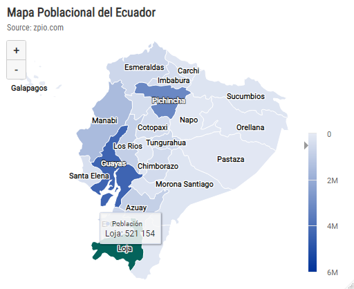
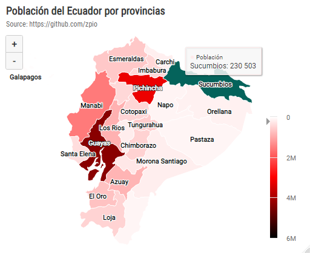
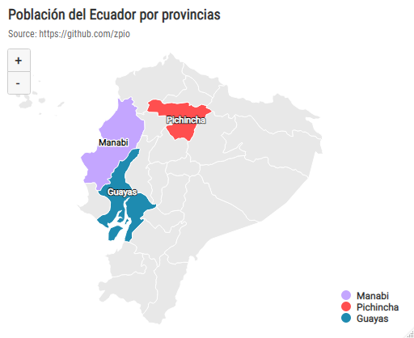
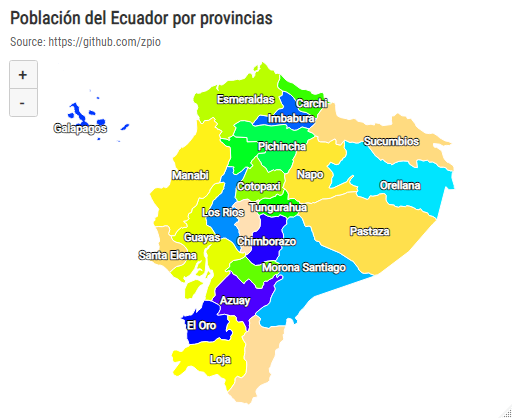
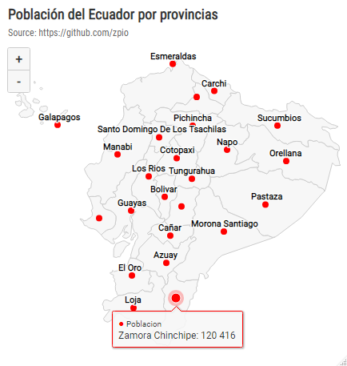

🦄 Graficando en R el Mapa del Ecuador
============================================

Apuntes de graficación del mapa del Ecuador con la libreria **highcharter**.


🔥 Cargamos las librerias necesarias
-------------------------------------
```r
library(tidyverse)
library(jsonlite)
library(httr)
library(highcharter)
```

🔥 Cargar la data del mapa en objeto lista de R
-----------------------------------------

Cargamos el archivo .json y lo convertimos en objeto lista.

```r
# En formato lista
mapa.ec <- 
  httr::GET("https://raw.githubusercontent.com/zpio/mapa-ecuador/main/ec-all.geo.json") %>% 
  httr::content(type = 'text') %>% 
  jsonlite::fromJSON(simplifyVector = FALSE)
```

🔥 Cargar la data del mapa en objeto data frame de R
-----------------------------------------
Cargamos el archivo .json y convertimos en data frame que lo usaremos para extraer las provincias.

```r
# En formato data frame
mapa_ec <- 
  jsonlite::fromJSON("https://raw.githubusercontent.com/zpio/mapa-ecuador/main/ec-all.geo.json") %>% 
  as.data.frame()
```

🔥 Crear un data frame de las provincias con sus coordenadas 
-----------------------------------------
Del data frame `mapa_ec` extraemos las provincias y creamos otro data frame de provincias con sus respectivas coordenadas de centroides.

```r
provincias <- 
  data.frame(
    name= mapa_ec$features.properties$name,
    lon = mapa_ec$features.properties$longitude,
    lat = mapa_ec$features.properties$latitude
  ) %>% 
  filter(name != is.na(name)) %>% 
  mutate(across(everything(), as.character)) %>% 
  mutate(across(c(lon, lat), as.numeric))
```

🔥 Cargamos la población 2020 del Ecuador por provincias
-----------------------------------------

```r
# Poblacion Ecuador por provincia 2020
pop_prov <- 
  read_csv('https://raw.githubusercontent.com/zpio/mapa-ecuador/main/pop_prov2020.csv')
```

🔥 Gráfica de mapa de la Población del Ecuador 
-----------------------------------------
**Mapa con colores degradados predeterminados**

```r
# Mapa con colores degradados predeterminados
highchart() %>% 
  hc_add_series_map(
    map = mapa.ec,
    df = pop_prov, 
    name= 'Población',
    value = "Poblacion2020",
    joinBy = c("name", "Provincia"),
    dataLabels = list(enabled = TRUE, 
                      format = '{point.name}'),
    states = list(hover = list(color='#04635b')),
    borderColor = "#FFFFFF"
  ) %>% 
  hc_mapNavigation(enabled = TRUE) %>% 
  hc_add_theme(hc_theme_smpl()) %>% 
  hc_title(text = "Población del Ecuador por provincias") %>%
  hc_subtitle(text = "Source: https://github.com/zpio") %>% 
  hc_legend(
    layout= 'vertical',
    align= 'right',
    verticalAlign= 'bottom'
  )
```



**Mapa con 2 colores degradados personalizados**

```r
# Mapa con 2 colores degradados personalizados
highchart() %>% 
  hc_add_series_map(
    map = mapa.ec,
    df = pop_prov, 
    name= 'Población',
    value = "Poblacion2020",
    joinBy = c("name", "Provincia"),
    dataLabels = list(enabled = TRUE, 
                      format = '{point.name}'),
    states = list(hover = list(color='#04635b')),
    borderColor = "#FFFFFF"
  ) %>% 
  hc_mapNavigation(enabled = TRUE) %>% 
  hc_add_theme(hc_theme_smpl()) %>% 
  hc_colorAxis(minColor = "#5ad1c7", maxColor = "#434348") %>% 
  hc_title(text = "Población del Ecuador por provincias") %>%
  hc_subtitle(text = "Source: https://github.com/zpio") %>% 
  hc_legend(
    layout= 'vertical',
    align= 'right',
    verticalAlign= 'bottom'
  )
```


**Mapa con mas de dos colores degradados personalizados**

```r
# Mapa con mas de dos colores degradados personalizados
highchart() %>% 
  hc_add_series_map(
    map = mapa.ec,
    df = pop_prov, 
    name= 'Población',
    value = "Poblacion2020",
    joinBy = c("name", "Provincia"),
    dataLabels = list(enabled = TRUE, 
                      format = '{point.name}'),
    states = list(hover = list(color='#04635b')),
    borderColor = "#FFFFFF"
  ) %>% 
  hc_mapNavigation(enabled = TRUE) %>% 
  hc_add_theme(hc_theme_smpl()) %>% 
  hc_colorAxis(stops = color_stops(3, c("white","red", "black"))) %>%
  hc_title(text = "Población del Ecuador por provincias") %>%
  hc_subtitle(text = "Source: https://github.com/zpio") %>% 
  hc_legend(
    layout= 'vertical',
    align= 'right',
    verticalAlign= 'bottom'
  )
```



**Mapa con colores diferentes en ciertas provincias**

```r
tres_prov <- pop_prov %>% 
  filter(Provincia %in% c("Guayas", "Pichincha", "Manabi")) %>% 
  arrange(Poblacion2020) %>% 
  mutate(value = 1:3)
```
```r
highchart() %>% 
  #hc_chart(backgroundColor = "#161C20") %>% #color fondo imagen
  hc_add_series_map(
    map = mapa.ec,
    df = tres_prov, 
    name= 'Población',
    value = "value",
    joinBy = c("name", "Provincia"),
    dataLabels = list(enabled = TRUE, 
                      format = '{point.Provincia}'),
    states = list(hover = list(color='#e3e3e3')),
    tooltip = list(pointFormat = "Pop: {point.Poblacion2020:,.0f}"),
    borderColor = "#FFFFFF",
    #para cambiar el tono gris del mapa
    nullColor = "#e8e8e8" ) %>% 
  hc_mapNavigation(enabled = TRUE) %>% 
  hc_add_theme(hc_theme_smpl()) %>% 
  hc_colorAxis(
    ataClassColor="category", 
    dataClasses = list(list(from=1, to=1, color ='#c4a6ff', name="Manabi"),
                       list(from=2, to=2, color = '#ff4f4f', name="Pichincha"),
                       list(from=3, to=3, color = '#1e8bb0', name="Guayas"))
    
  ) %>%
  hc_title(text = "Población del Ecuador por provincias") %>%
  hc_subtitle(text = "Source: https://github.com/zpio") %>% 
  hc_legend(
    layout= 'vertical',
    align= 'right',
    verticalAlign= 'bottom')
```




**Mapa con color diferente en cada provincia**

```r
n_prov <- pop_prov %>% 
  mutate(value = 1:24)
```

```r
# usar un vector de colores o una paleta
prov_categ <- n_prov %>% 
  mutate(color = topo.colors(24)) %>% 
  rename(name = Provincia) %>% 
  mutate(from = seq(1:24),
         to = from +1) %>% 
  select(!value)%>% 
  list_parse()
```

```r
highchart() %>% 
  #hc_chart(backgroundColor = "#161C20") %>% #color fondo imagen
  hc_add_series_map(
    map = mapa.ec,
    df = n_prov, 
    name= 'Población',
    value = "value",
    joinBy = c("name", "Provincia"),
    dataLabels = list(enabled = TRUE, 
                      format = '{point.Provincia}'),
    states = list(hover = list(color='#e3e3e3')),
    tooltip = list(pointFormat = "{point.name}: {point.Poblacion2020:,.0f}"),
    borderColor = "#FFFFFF",
    #para cambiar el tono gris del mapa
    nullColor = "#e8e8e8"  
  ) %>% 
  hc_mapNavigation(enabled = TRUE) %>% 
  hc_add_theme(hc_theme_smpl()) %>% 
  hc_colorAxis(
    ataClassColor= "category", 
    dataClasses = prov_categ
  ) %>%
  hc_title(text = "Población del Ecuador por provincias") %>%
  hc_subtitle(text = "Source: https://github.com/zpio") %>% 
  hc_legend(enabled = FALSE)
```



**Provincias con sus coordenadas y Población**

Hacemos un join con las coordenadas de las provincias y la población
```r
prov_lat_lon <- provincias %>% 
  left_join(pop_prov, by = c('name'='Provincia')) %>% 
  rename(z = Poblacion2020)
```


**Mapa con 'puntos' de un solo color**

```r
highchart(type = "map") %>%
  hc_add_series(
    mapData = mapa.ec, 
    showInLegend = FALSE) %>% 
  hc_add_series(
    data = prov_lat_lon, 
    type = "mappoint",
    name = "Poblacion", 
    minSize = "1%",
    maxSize = "10%",
    color = 'red',
    tooltip = list(pointFormat = "{point.name}: {point.z:,.0f}")
  ) %>% 
  hc_mapNavigation(enabled = TRUE) %>% 
  hc_add_theme(hc_theme_smpl()) %>% 
  hc_title(text = "Población del Ecuador por provincias") %>%
  hc_subtitle(text = "Source: https://github.com/zpio") %>% 
  hc_legend(
    layout= 'vertical',
    align= 'right',
    verticalAlign= 'bottom')
  ```
  



**Mapa agregando 'bubbles' de un solo color**

Hacemos un join con las coordenadas de las provincias y la población

```r
highchart(type = "map") %>%
  hc_add_series(
    mapData = mapa.ec, 
    showInLegend = FALSE) %>% 
  hc_add_series(
    data = prov_lat_lon, 
    type = "mapbubble",
    name = "Poblacion", 
    minSize = "1%",
    maxSize = "10%",
    color = 'red'
  ) %>% 
  hc_mapNavigation(enabled = TRUE) %>% 
  hc_add_theme(hc_theme_smpl()) %>% 
  hc_title(text = "Población del Ecuador por provincias") %>%
  hc_subtitle(text = "Source: https://github.com/zpio") %>% 
  hc_legend(
    layout= 'vertical',
    align= 'right',
    verticalAlign= 'bottom')

```


**Mapa agregando 'bubble' con degradado por cantidad**

```r
highchart(type = "map") %>%
  hc_add_series(
    mapData = mapa.ec, 
    showInLegend = FALSE
  ) %>% 
  hc_add_series(
    data = prov_lat_lon, 
    type = "mapbubble",
    name = "Poblacion", 
    minSize = "1%",
    maxSize = "10%"
  ) %>% 
  hc_mapNavigation(enabled = TRUE) %>% 
  hc_add_theme(hc_theme_smpl()) %>% 
  hc_colorAxis(minColor = "#5ad1c7", maxColor = "#434348") %>% 
  hc_title(text = "Población del Ecuador por provincias") %>%
  hc_subtitle(text = "Source: https://github.com/zpio") %>% 
  hc_legend(
    layout= 'vertical',
    align= 'right',
    verticalAlign= 'bottom')

```


---------------------------------------------------------------------


